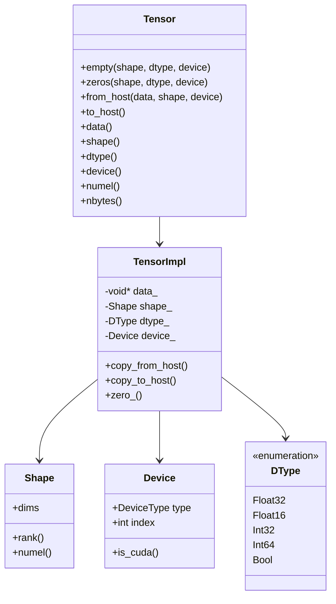
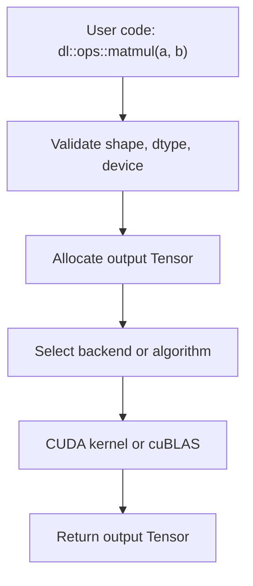
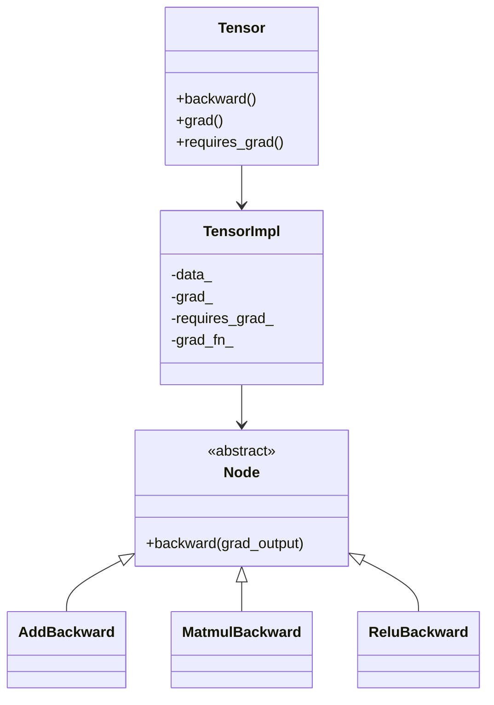
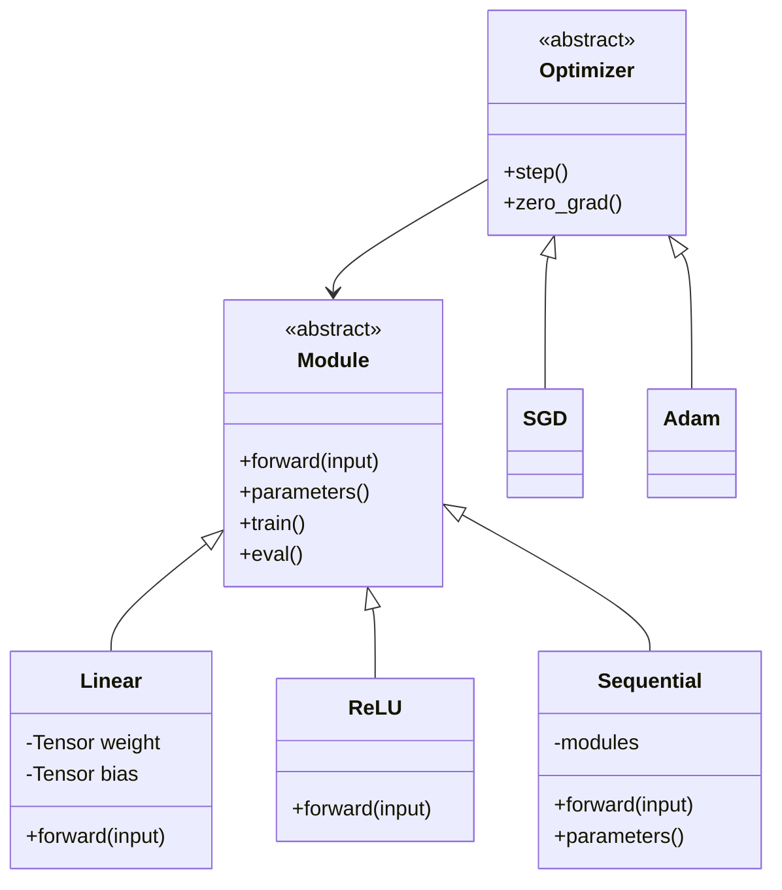
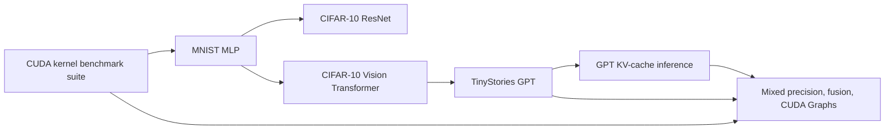

# Future Work

This project is a CUDA-first deep learning library. The long-term goal is to grow from core tensor operations into full training and optimized inference demos.

## Proposed Architecture

The intended architecture is:

```text
User API
  -> Tensor / Module / Optimizer
  -> Ops
  -> Dispatcher or backend policy
  -> CUDA kernels / cuBLAS / fused kernels
```

Keep the active API CUDA-first and tensor-based. Old Eigen-based code should remain in `legacy/` unless it is rewritten around `dl::Tensor`.

### Core Tensor Architecture



### Ops And Kernel Path



Current ops should follow this structure:

```text
include/dl/ops/Foo.hpp
src/ops/Foo.cpp
include/dl/kernels/foo.hpp
src/kernels/cuda/foo.cu
tests/tensor/foo_tensor_test.cpp
```

### Future Autograd Architecture



Start autograd only after forward ops are stable. First support the minimum ops needed for MNIST MLP.

### Future Module And Training Architecture



### Demo Dependency Roadmap



## Demo Roadmap

1. CUDA kernel benchmark suite
   - Keep benchmarking GEMM, softmax, reductions, transpose, elementwise ops, and future fused kernels.
   - Use Nsight Compute reports as performance evidence.

2. MNIST MLP
   - Prove basic tensor, layer, loss, optimizer, and autograd correctness.
   - Required pieces: `Linear`, `ReLU`, `matmul`, `add`, cross entropy, SGD, and backward passes.

3. CIFAR-10 ResNet
   - Add convolution support and train a small CNN/ResNet.
   - Required pieces: `Conv2D`, pooling, normalization, residual blocks, and image data loading.

4. CIFAR-10 Vision Transformer
   - Add Transformer encoder support for vision.
   - Required pieces: patch embedding, layer norm, attention, MLP block, and positional embeddings.

5. TinyStories GPT
   - Train a small GPT-style Transformer from scratch.
   - Required pieces: tokenization, embeddings, causal attention, Transformer blocks, optimizer state, and checkpointing.

6. GPT KV-cache inference
   - Add optimized autoregressive inference.
   - Required pieces: KV cache storage, incremental attention, fast sampling, and model loading.

7. Mixed precision, fusion, and CUDA Graphs
   - Improve framework performance after correctness is stable.
   - Required pieces: FP16/BF16 tensors, fused kernels, cuBLASLt, CUDA Graph capture, and async execution.

## Near-Term Engineering Tasks

1. Finish forward ops
   - Elementwise: `add`, `sub`, `mul`, `div`
   - Activations: `relu`, `sigmoid`, `tanh`
   - Neural network ops: `linear`, `cross_entropy`, `layernorm`

2. Add tests for every op
   - Each test should print:
     - `xxx_test : passed`
     - `xxx_test : not passed`

3. Add benchmarks for kernel-heavy ops
   - Keep `scripts/run_linux_benchmarks.sh` building all tests and benchmarks.
   - Keep Nsight Compute summaries readable.

4. Add autograd after forward ops are stable
   - Start with backward support for MNIST MLP only:
     - `add`
     - `matmul`
     - `relu`
     - `cross_entropy`

5. Add model/layer abstractions
   - Build layers on top of `dl::Tensor` and `dl::ops`.
   - Avoid bringing old Eigen-based code back into the active API.

6. Add checkpointing
   - Save and load model parameters as host-side binary tensor data.
   - Start with Float32 weights only.

7. Add inference features
   - `model.eval()`
   - fast model loading
   - KV cache for GPT-style generation
