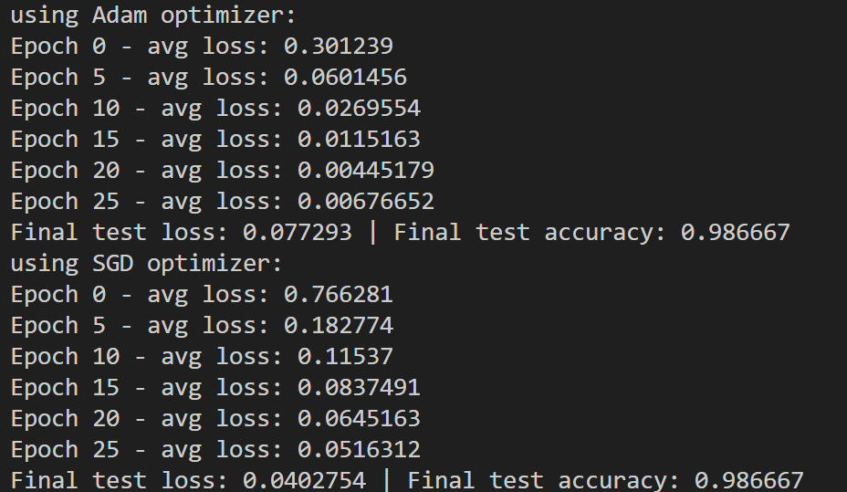

# Deep Learning Sprint2 - Group 93

A C++ implementation of basic neural network building blocks from scratch, including data loading, layers, loss functions, and optimizers. This project implements a complete neural network framework using only Eigen for matrix operations.

##      Table of Contents

- [Overview](#overview)
- [Prerequisites](#prerequisites)
- [Project Structure](#project-structure)
- [Build & Run](#build--run)
- [Testing](#testing)

##  Overview

This project implements a neural network framework using object-oriented design in C++. The framework supports building and training neural networks for classification tasks (e.g., MNIST digit recognition) using only Eigen for matrix operations.

### Sprint 1: Task has been completed.

This sprint is about setting up the project, making data accessible in the code and performing basic computations.

### Sprint 2: Modularising using OOP

This sprint is about structuring the code in a modular fashion to ultimately allow flexible generation of network architectures.

### Sprint 3 Code quality and performance

This sprint is about finalising the project by cleaning and optimising the code.

##  Prerequisites

- **C++ Compiler**: GCC or Clang with C++17 support
- **Eigen Library**: Version 3.3+ (must be available at `./eigen-5.0.0` or configure the include path in `Makefile`)

### Installing Eigen

If Eigen is not in `./eigen-5.0.0`, you can:

1. Download from [Eigen website](https://eigen.tuxfamily.org/)
2. Extract to `./eigen-5.0.0/`
3. Or modify `CXXFLAGS` in `Makefile` to point to your Eigen installation
<pre>
CXXFLAGS = -std=c++17 -O2 -Wall -Wextra -I ./eigen-5.0.0
</pre>

##  Project Structure

```
93-dl/
├── Layer.hpp/cpp                # Base Layer class
├── LinearLayer.hpp/cpp          # Linear (fully-connected) layer
├── SigmoidLayer.hpp/cpp         # Sigmoid activation layer
├── SoftmaxCrossEntropyLoss.hpp/cpp  # Combined softmax + cross-entropy loss
├── Network.hpp/cpp              # Network class (manages layers)
├── Optimizer.hpp/cpp            # Optimizer base class and SGD
├── test_oop.cpp                 # OOP layer tests
├── test_network.cpp             # Full network training test
├── Makefile                     # Build configuration
└── mnist/                        # Image dataset
```

## Build & Run

### Build All Tests

```bash
make test         # Compile all test programs
```

##  Testing

### Test Suite Overview

The project includes test programs that verify Sprint 3 components:

1. **`test_layers`**: Test Layers forward and backward
2. **`test_oop`**: Tests OOP layer classes (LinearLayer, SigmoidLayer) and SGD optimizer
3. **`test_network`**: Tests complete network training pipeline
1. **`test_train_mnist`**: training on mnist dataset and test model on a test set


### Run Individual Tests for Basic Functionality

```bash
./bin/test_layers     # Test layers
./bin/test_oop        # Test OOP layers and SGD
./bin/test_network    # Test full network training
```

### Running Final Tests

```bash
make test
./bin/test_train_mnist # you can train a multiclass classifier on mnsit dataset 
```

### Clean Build Artifacts

```bash
make clean        # Remove all .o files and executables
```

### Building and Training a Network

```cpp
#include <iostream>
#include <Eigen/Dense>

#include "LinearLayer.hpp"
#include "SigmoidLayer.hpp"
#include "ParametricReLU.hpp"
#include "SoftmaxCrossEntropyLoss.hpp"
#include "Network.hpp"
#include "Optimizer.hpp"
#include "DataLoader.hpp"

  //load data 
  DataLoader train(
      "mnist/train-images-idx3-ubyte",
      "mnist/train-labels-idx1-ubyte"
  );
  DataLoader test(
      "mnist/t10k-images-idx3-ubyte",
      "mnist/t10k-labels-idx1-ubyte", 
      300
  );
    
  int n    = train.getSize();

  const Eigen::MatrixXf& X_all = train.getImagesMatrix(); 
  int input_dim   = X_all.cols(); 
  int num_classes = 10;

  //set up network architecture
  Network net;
  net.set_optimizer(&optimizer);

  net.add_layer(std::make_unique<LinearLayer>(input_dim, 128));
  net.add_layer(std::make_unique<ParametricReLU>(128, 0.1f));
  net.add_layer(std::make_unique<LinearLayer>(128, num_classes));

  // training loop
  for (int epoch = 0; epoch < epochs; ++epoch) {
      float epoch_loss_sum = 0.0f;
      int   batches_in_epoch = 0;
      // each iteration with batch size
      for (int start = 0; start < n; start += batch_size) {
          int end    = std::min(start + batch_size, n);
          int b_size = end - start;  

          Eigen::MatrixXf X_batch = X_all.block(start, 0, b_size, input_dim);

          Eigen::VectorXi y_batch(b_size);
          for (int i = 0; i < b_size; ++i) {
              y_batch(i) = train.getLabels(start + i);
          }
          // forward and backward pass, compute loss, update parameters
          net.forward(X_batch);
          float loss = net.compute_loss(y_batch);
          net.backward();
          net.update();

          epoch_loss_sum += loss;
          ++batches_in_epoch;
      }

      float avg_loss = epoch_loss_sum / static_cast<float>(batches_in_epoch);

      if (epoch % 5 == 0) {
          std::cout << "Epoch " << epoch << " - avg loss: " << avg_loss << "\n";
      }
  }

```

### Expected Test Outputs (You can see training with 2 different optimizers and their losses and accuracy) 




